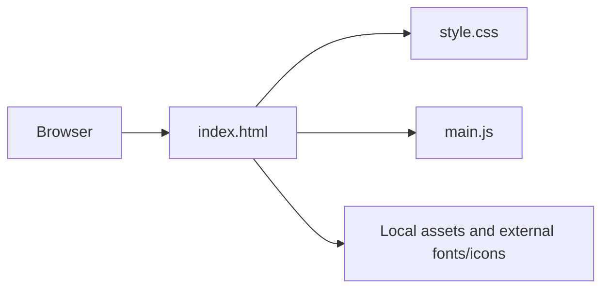

# MainCrafts Landing Page

<p align="center"><strong>A responsive single-page landing site created for the MainCrafts internship Task 1.</strong></p>

<p align="center">HTML · CSS · JavaScript · Vite</p>

## Project overview

This repository contains a static landing-page experience with its page markup, styling, JavaScript interactions, and Vite configuration. It is a frontend exercise; there is no application server or database in this repository.

## Architecture



## Run locally

```bash
npm install
npm run dev
```

Open the local URL printed by Vite. Create a production bundle with `npm run build`; preview that bundle with `npm run preview`.

## Project structure

- `index.html` — landing page
- `style.css` — responsive layout and styling
- `main.js` — interactive behavior
- `public/` — icon assets
- `vercel.json` — static deployment configuration

## Scope

The page contains placeholder social links. Replace them with verified profile URLs before presenting the site as a personal or company landing page.
